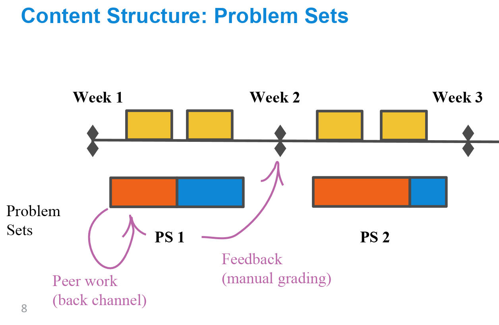
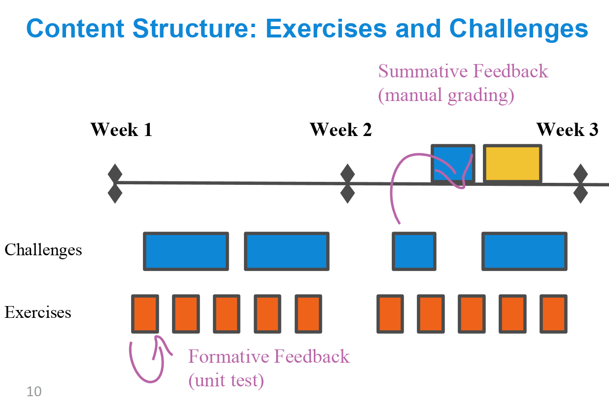

---
authors:
- admin
categories:
- Teaching
date: "2020-08-22T00:00:00Z"
draft: false
featured: false
image:
  caption: 'Image credit: Zachary del Rosario'
  focal_point: ""
  placement: 2
  preview_only: false
lastmod: "2020-08-31:00:00Z"
projects: []
subtitle: ''
summary: To get ready to teach online in the fall, I ran a summer offering of Data Science for Olin Alumni.
tags:
- Teaching
- Data Science
- Olin
title: 'Summer Data Science'
---

The pandemic lockdown required us to work in new ways. While I'd spent much of my time in graduate school learning how to teach in-person, teaching online was new to me. Knowing my fall would likely involve *a lot* of online teaching, I ran a summer offering of Data Science for Olin Alumni to get some more experience.

Part of what I wanted to figure out is how to *structure* an online class. A traditional way to teach (in-person) is to lecture and assign problem sets, depicted below visually.

There are a [lot of problems](https://www.pnas.org/content/116/39/19251) with lecture as a means of content "delivery," but one of the new challenges with teaching online is that even problem sets become problematic. In a residential college setting, students are living in close proximity to one another, so they can easily ask each other questions about their homework. Essentially, there is a "back channel" for rapid feedback provided by informal peer work, totally decoupled from the instructor. This source of feedback is disrupted in an online environment, where it's much harder for students to coordinate and work together.

To address this (and other issues), I broke my problem sets into *exercises* and *challenges*.

*Exercises* contain the mechanics parts of the class; for instance, the basics
of data algebra, including filters, joins, pivots, etc. These exercises contain
unit tests that automatically check the correctness of students work.
Additionally, I give the students the solution sets in separate files, so they
can easily look up the answers if they're stuck. Students complete about an
hour's worth of exercises per day. This keeps students regularly engaged in
their work, gives them instant feedback on their efforts, and replaces lecture
so they sit through fewer boring Zoom meetings. Of course I can't reasonably
grade these exercises, which is where *challenges* come in.

*Challenges* emphasize more critical thinking, and take much longer to complete.
Unlike exercises, I do not provide the solutions for challenges, and I grade
them based on a rubric. This way students know exactly what kind of work I'm
looking for, and they get a chance to recall and deploy the lessons they learned
in the exercises. Additionally I use the challenges to seed in-class discussions
about datasets, so that students gain experience talking about data science, and
learn how to communicate their results in a professional setting.

Naomi Walker of Olin College posted a [nice interview](http://www.olin.edu/news-events/2020/olin-alumni-co-design-virtual-curriculum/) about the class!
